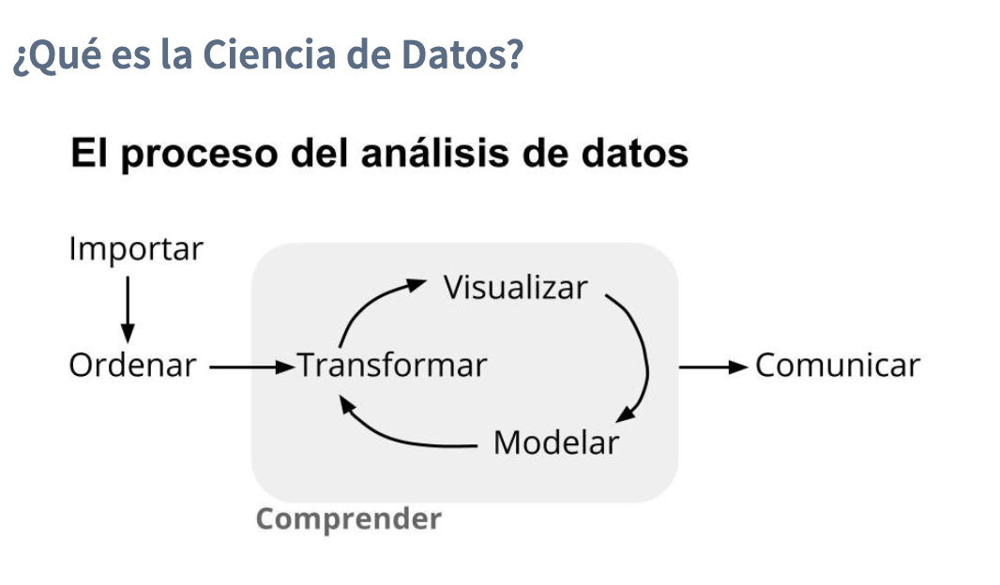
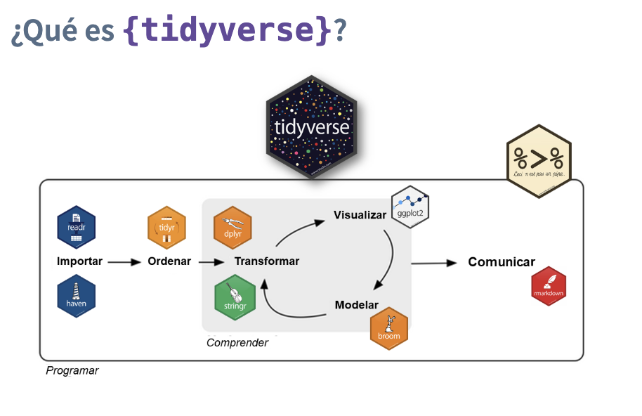
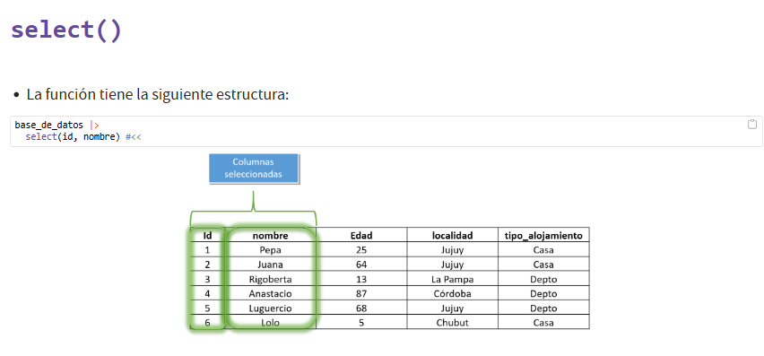
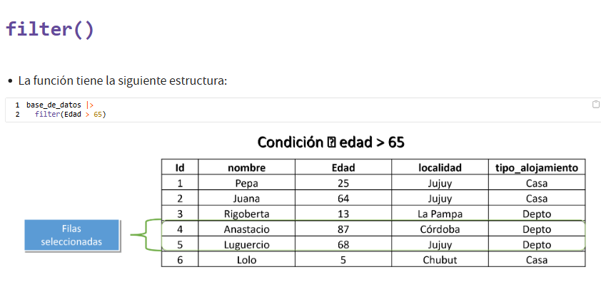
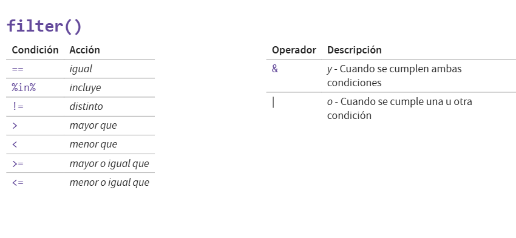
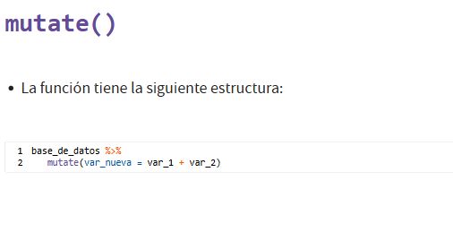
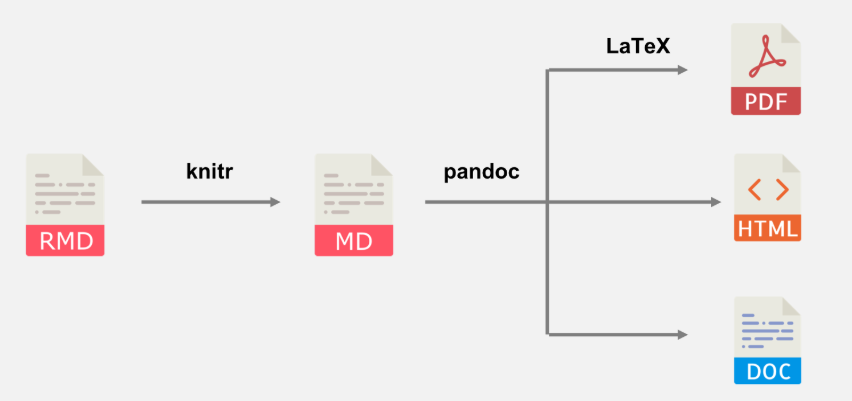
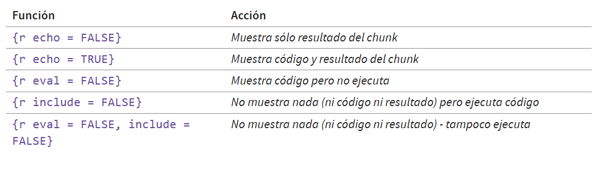

```{r setup, include=FALSE}
# Configuración general del documento y de las gráficas
knitr::opts_chunk$set(
  echo = TRUE,          # Mostrar el código en el documento
  fig.width = 6,        # Ancho de las figuras (en pulgadas)
  fig.height = 4,       # Alto de las figuras
  fig.align = "center", # Centra las gráficas
  out.width = "80%",    # Ajusta el ancho relativo dentro del documento
  dpi = 300             # Resolución (para PDFs más nítidos)
)
```

\noindent\rule{0.95\linewidth}{0.5pt}
# CLASE 1. Introducción a R
\noindent\rule{0.95\linewidth}{0.5pt}

## 1. Valores
Pueden ser de distintos tipos:

processing file: Apuntes.Rmd
                                                                                                                                         
"C:/Program Files/RStudio/resources/app/bin/quarto/bin/tools/pandoc" +RTS -K512m -RTS Apuntes.knit.md --to latex --from markdown+autolink_bare_uris+tex_math_single_backslash --output Apuntes.tex --lua-filter "C:\Users\rexca\AppData\Local\R\win-library\4.5\rmarkdown\rmarkdown\lua\pagebreak.lua" --lua-filter "C:\Users\rexca\AppData\Local\R\win-library\4.5\rmarkdown\rmarkdown\lua\latex-div.lua" --embed-resources --standalone --highlight-style tango --pdf-engine xelatex --variable graphics --include-in-h

* **numeric:** valores numéricos, incluye decimales.
* **integer:** números enteros, no incluye decimales.
* **character:** valores alfanuméricos, es decir, letras, números y signos mezclados. 
* **logical:** valores lógicos, TRUE o FALSE.

## 2. Vectores
Son un conjunto de valores concatenados, usualmente se utiliza la función combine = c() para ello.
```{r Vectores}
c(100,102,200) # la función combine sirve para concatenar valores que pueden ser de distintos tipos
c("cien","ciento dos","doscientos") 
c(100, "101", 105) # aquí transforma todos los valores en string 
```
## 3. Funciones
Reciben un input y devuelven un output: nombre_de_la_funcion(input).

La función class() devuelve el tipo del valor o vector que le de (input). Esta función espera que le des un valor o un vector, pero no se puede darle dos valores o dos vectores.
```{r Función class}
class(1)
class("hola")
class(TRUE)
class(1.97)
class(NA)
class(c("hola", 100, 4.6)) #transforma todo a character 
#class(1,2) esto no se puede hacer
```

La función length() devuelve el largo del input. Es decir, cuenta el total de valores que tiene un vector.
```{r Función length}
length(c(10,20,30)) #tienes un vector que tiene 3 valores diferentes
length(c("2",3,"amigo",1.98))
```

La función mean() calcula el promedio de un input (tiene que ser sí o sí numérico).
```{r Función mean}
mean(c(10,20,30))
mean(c("10","20","30"))
```

## 4. Objetos
Todo en R puede ser guardado en un objeto (un valor, un vector, el resultado de una función, etc).
Para guardar algo en un objeto, se tiene que seguir la siguiente estructura:
```{r Objetos}
nombre_del_objeto <- ("algo") #aquí se guarda el objeto, que lo podemos ver almacenado en nuestro "environment"
nombre_del_objeto #al imprimirlo obtenemos lo que guardamos dentro de él
class(nombre_del_objeto) 

objeto1 <- 2+2 
objeto2 <- mean(c(2,5,10))
objeto_vector <- c(1,3,2,5)

mean(c(1,3,2,5))
mean(objeto_vector)
```
## 5. Data Frames
Es una tabla. Una tabla es una combinación de vectores (variables), que termina conformando una relación entre filas y columnas.
Cada vector es una columna de un dataframe y cada uno de sus valores, en el orden que se encuentran, conforman las filas.

Para crear un Data Frame se puede utilizar la función data.frame(), cuyos inputs son los vectores:
```{r Data Frames}
vector_edad <- c(20,43,102,56)
vector_nombre <- c("Pepe","Pepa","Rigoberto","Ana")
base_personas <- data.frame(vector_edad,
                            vector_nombre)
base_personas
```

```{r Acceder a datos de un Data Frame}
base_personas$vector_edad #acceder a lo que contiene la variable de una base de datos
mean(base_personas$vector_edad) #hacer calculos con las variables dentro de una base de datos
```

## 6. Ejercicios 
a. Crear un vector llamado apellido con 7 apellidos.
```{r}
apellido <- c("García","Sánchez","Van Del Sar",
              "Mihatovich","Lama","Lugercio",
              "Messidona")
```

b. Crear un vector cantidad con 7 valores, que representen la frecuencia con la que existe cada apellido en nuestra base.
```{r}
cantidad <- c(1,3,17,9,2,34,98)
```

c. Con estos vectores, crear un data.frame que los combine y...
```{r}
datos <- data.frame(apellido,cantidad)
```

* Sume la cantidad de apellidos total que hay en la base (la función sum() puede ayudar al respecto).
```{r}
length(datos$apellido) 
sum(datos$cantidad)
```

* Calcule el apellido que más frecuencia tiene.
```{r}
max_frecuencia <- max(datos$cantidad)
apellido_max <-datos$apellido[datos$cantidad == max_frecuencia]
apellido_max
```

* Calcule el apellido que menos frecuencia tiene.
```{r}
min_frecuencia <- min(datos$cantidad)
apellido_min <- datos$apellido[datos$cantidad == min_frecuencia]
apellido_min
```


\noindent\rule{0.95\linewidth}{0.5pt}
# CLASE 2. Importación de archivos y proyectos de trabajo con R
\noindent\rule{0.95\linewidth}{0.5pt}

## 1. Paquetes
Los paquetes o librerías son la potencia de los lenguajes como R y Python. Son herramientas que nos permiten elaborar cosas específicas en nuestro entorno de trabajo.
```{r Instalar librerías}
# install.packages("readr") #se instala una vez por computadora
# library(readr) #se convoca por cada sesión de R
```

## 2. Ruta de archivos e importar datos
Es la ubicación de una carpeta/archivo en mi computadora. Todas las carpetas dentro de una computadora tienen una ruta de acceso.
```{r Importar datos, message=FALSE}
library(readr)
# setwd("C:/Users/rexca/OneDrive/Documentos/CURSOS/Estacion R/Datos")
# base_nombres <- read_csv("nombres-1920-1924.csv")
base_nombres <- read_csv("Datos/nombres-1920-1924.csv")
names(base_nombres) #da los nombres de las columnas 
```

## 3. Funciones para su aplicación en Data Frames
### 3.1 Otros paquetes
```{r Librerías río y eph, message=FALSE}
# install.packages("rio")
library(rio) #es una navaja suiza para importar/exportar datos.
```

### 3.2 Funciones
a. **dim():** Devuelve las dimensiones del data frame (número de filas y columnas).
```{r Función dim}
dim(base_nombres)
```

b. **colnames():** Muestra los nombres de las columnas.
```{r Función colnames}
colnames(base_nombres) 
```

c. **str():** Da la estructura: tipo de objeto, número de observaciones, variables y sus clases.
```{r Función str}
str(base_nombres) 
```

d. **summary():** Da un resumen estadístico de cada columna (mínimo, máximo, media, etc. en numéricas).
```{r Función summary}
summary(base_nombres) 
```

e. **table():** Intenta hacer una tabla de frecuencias de todas las variables (puede no funcionar bien con un data frame completo).
```{r Función table}
table(base_personas)
```

f. **is.na():** Devuelve una matriz lógica con TRUE/FALSE indicando si cada celda es NA.
```{r Función is.na}
is.na(base_personas) 
```

g. **mean():** Calcula la media, pero solo funciona si el objeto es numérico (no para todo el data frame).
```{r Función mean en un data frame}
mean(base_personas$vector_edad) 
```


\noindent\rule{0.95\linewidth}{0.5pt}
# CLASE 3, 4 y 5. Operador Pipe y selección de columnas; Tidyverse I, II y III
\noindent\rule{0.95\linewidth}{0.5pt}

## 1. Procesamiento de datos con Tidyverse


Tidyverse es una colección de paquetes que permite dar respuestas al processo del análisis de datos.



## 2. Operador pipa 
Concatena distintas líneas de código.
```{r Librería tidyverse, include=FALSE}
library(tidyverse)
```

a. Ejemplo sin uso de Pipe
```{r Sin operador Pipe}
datos <- data.frame(nombre = c("Regina", "Tina","Manolo","Roxana","Tulús"),
                    edad = c(24, 21, 26, 60, 1))

round(prop.table(table(datos$nombre)), digits = 1) 
#table() muestra la frecuencia en la que aparecen todas las variables de una base de datos
#prop.table() toma el resultado de un table y cambia los resultados a proporciones
#round() al input que corresponda, siempre que sea un valor numérico, lo redondea.
#Utiliza el parámetro digits para establecer la cantidad de decimales que se quiere observar
```

b. Ejemplo utilizando Pipe
```{r Con pipe}
datos$nombre %>% 
  table() %>% 
  prop.table() %>% 
  round(digits = 1)
```

## 3. Funciones de dplyr
### 3.1 **select():** Permite seleccionar columnas o variables. 



```{r Importación de base normal, message=FALSE}
library(tidyverse)
library(readr)

#Importación de datos
df_puna <- read_csv("Datos/puna_base_agregada.csv")

#Exploración de base
colnames(df_puna) #Nos otorga el nombre de las variables de nuestra base de datos
```

a. Por variables de interés
```{r Select() por variables de interés}
df_puna_sel <- df_puna %>% #Cantidad de plazas que hay por localidad y por tipo de alojamiento 
  select(localidad, tipo, plazas)
colnames(df_puna_sel)
```

b. Por posición
```{r Select() por posición}
df_puna_sel_pos <- df_puna %>%  
  select(7, 9, 13)

df_puna_sel_pos2 <- df_puna %>%  
  select(1:3)

colnames(df_puna_sel_pos)
colnames(df_puna_sel_pos2)
```

c. Por nombre (consecutiva)
```{r Select() por nombres}
df_puna_sel_pos3 <- df_puna %>%  
  select(establecimientos:plazas) #selecciona las variables que van desde establecimientos hasta plazas

colnames(df_puna_sel_pos3)
```

d. Por patrones de texto
```{r Select() por patrones de texto}
df_puna_sel_patr1 <- df_puna %>%  
  select(starts_with("provincia")) #empieza con...

df_puna_sel_patr2 <- df_puna %>%  
  select(ends_with("o")) #termina con...

df_puna_sel_patr3 <- df_puna %>%  
  select(contains("_")) #si contiene en algun lugar de su nombre..

colnames(df_puna_sel_patr1)
colnames(df_puna_sel_patr2)
colnames(df_puna_sel_patr3)
```

e. Por selección combinada
```{r Select() por selección combinada}
df_puna_sel_tuto <- df_puna %>%  
  select(localidad, 2, starts_with("provincia"), 9:11)

colnames(df_puna_sel_tuto)
```

f. Para descartar
```{r Select() para descartar}
df_puna_sel_sinloc <- df_puna %>%  
  select(-localidad) 

colnames(df_puna_sel_sinloc)
```

### 3.2 **filter():** Define los casos (filas) en base una condición. 





### Caso práctico
La encargada de la oficina de turismo de Buenos Aires quiere que le arme una base sólo con alojamientos de tipo Camping y Hoteles 3 estrellas.
```{r Importación de datos y análisis con unique()}
#Importar datos
df_puna <- read.csv("Datos/puna_base_agregada.csv") 

#Exploración de base
unique(df_puna$clasificacion) #Indica los valores únicos que contiene una variable

##Esta forma es lo mismo que lo anterior pero usando tidyverse
# df_puna %>%  
#   select(clasificacion) %>% #lo que viene antes del pipe es el input de la función anterior
#   unique()
```

a. Filtrado utilizando condiciones
```{r Filtro con condiciones}
df_filtrada <- df_puna %>% 
  filter(clasificacion == "Camping" | clasificacion == "Hotel 3 estrellas")  #la variable clasificación contenga el valor "Camping" Y "Hotel 3 estrellas".
```

b. Filtrado utilizando **%in%**
```{r Filtro con operador %in%}

df_filtrada2 <- df_filtrada %>% 
  filter(clasificacion %in% c("Camping", "Hotel 3 estrellas")) #el valor que tiene cada fila en la variable clasificación, esté incluida en los valores "Camping" y "Hotel 3 estrellas"
```

c. Filtrado creando un vector
```{r Filtro con vector}
#3era opción
vector_filtro <- c("Camping", "Hotel 3 estrellas", "Apart hotel", "Motel") 
df_vector <- df_puna %>% 
  filter(clasificacion %in% vector_filtro)
```

d. Revisar que el filtro utilizado haya sido correcto
```{r Revisión de filtrado}
unique(df_filtrada$clasificacion) #Primer chequeo para verificar si el filtro se utilizó correctamente
table(df_puna$clasificacion) #Segundo chequeo
```

e. Uso de **select()** y **filter()**
```{r select y filter}
#5. Uso de Select() + Filter()
select_filter <- df_puna %>% 
  select(localidad,
         clasificacion) %>% 
  filter(clasificacion %in% c("Camping", "Hotel 3 estrellas"))
```

### 3.3 Ejercicios

a. Crear un objeto que contenga la base de PUNA sólo con las variables localidad, ruta_natural y plazas. En ese mismo objeto, quedarse sólo con las filas de la ruta natural Delta.
```{r Creación de Data Frame}
df_filtrada3 <- df_puna %>% 
  select(localidad,
         ruta_natural,
         plazas) %>% 
  filter(ruta_natural == "Delta") 
```


b. Calcular cuántas plazas hay en total para la ruta natural Delta.
```{r Cálculo de resultados}
sum(df_filtrada3$plazas)
summary(df_filtrada3)
```


### 3.4 **mutate():** Permite construir nuevas columnas/variables en las bases de datos.


### Caso práctico
Llega a la oficina una persona interesada en saber cuál es el valor total disponible para dormir en los establecimientos. Quiere, entonces, conocer el resultado de la suma entre habitaciones y plazas.

a. Total de lugares disponibles en los establecimientos de todas las localidades.
```{r Total de establecimientos}
df_lugar_tot <- df_puna %>% 
  select(localidad, habitaciones, plazas) %>% 
  mutate(lugar_disponible = habitaciones + plazas)

sum(df_lugar_tot$lugar_disponible)
```

b. Investigar los casos en donde no hay lugares disponibles.
```{r Casos no disponibles, include=FALSE}
summary(df_lugar_tot$lugar_disponible) #Es muy útil para bases sucias para identificar valores nulos

df_lugar_tot1 <- df_lugar_tot %>% #Casos con 0 habitaciones y 0 plazas
  filter(lugar_disponible == 0) #Quedarnos con las observaciones que tiene 0 en lugares disponibles
```

b. Integrar una nueva variable que combine el tipo y la localidad usando mutate() + paste().
```{r Integrar nueva variable}
df_lugar_tot2 <- df_puna %>% 
  select(localidad, habitaciones, plazas, tipo) %>% 
  mutate(lugar_disponible = habitaciones + plazas,
         localidad_tipo = paste(localidad, tipo, sep = "_")) #Permite concatenar valores y separarlos por el elemento que escojamos
```

c. Recodificar el nombre de variables utilizando mutate () + case_when() 
```{r Recodificación de variables}
df_tiempo <- df_puna %>% 
  select(indice_tiempo, localidad, plazas) %>% 
  mutate(anio_etiqueta = case_when(indice_tiempo == 2020 ~ "Año 2020",
                                  indice_tiempo == 2021 ~ "Año 2021",
                                  indice_tiempo == 2022 ~ "Año 2022",
                                  indice_tiempo == 2023 ~ "Año 2023" )) #Agregarle una etiqueta a la variable indice_tiempo (pasar de 2020 a "Año 2020")
```

d. Quedarse solo con el alojamiento de tipo Hotelero
```{r Alojamiento tipo hotelero}
df_hotelero <- df_puna %>% 
  select(tipo, plazas) %>% 
  mutate(tipo_agrupado = case_when(tipo == "Hoteleros" ~ "Hoteleros", 
                                   .default = "Otros")) #Construir una nueva variable en la cual cuando el tipo es igual a "Hoteleros" se llamará "Hoteleros" y el resto que se llame "Otros"
```

e. Reagrupar unicamente a los hoteles de 1, 2 y 3 estrellas, para compararlos frente al resto
```{r Hoteles hasta 3 estrellas, warning=FALSE}
df_hotelero2 <- df_puna %>% 
  select(clasificacion, plazas) %>% 
  mutate(clasif_agrupado = case_when(clasificacion %in% c("Hotel 1 estrella", #Toma los casos en donde clasificación esté incluido en x vector
                                                          "Hotel 2 estrellas",
                                                          "Hotel 3 estrellas") ~ "Hotel hasta 3 estrellas", .default = "Otros"),
         clasif_agrupado_v2 = case_when(grepl("Hotel [1-3]", clasificacion) ~ "Hotel hasta 3 estrellas", .default = "Otros")) #Cuando se cumple la condición, se clasifica el vector como "Hotel hasta 3 estrellas" y el resto como "Otros"

table(df_hotelero2$clasif_agrupado, df_hotelero2$clasif_agrupado_v2, exclude = NULL) #chequeo
```

f. Ejercitación extra: Reagrupar la variable clasificacion para quedarme con 2 categorìas: "Camping", "Otros"
```{r Reagrupar variable}
df_ejercicio <- df_puna %>% 
  select(localidad, clasificacion) %>% 
  mutate(nueva_clasificacion = case_when(clasificacion == "Camping" ~ "Camping", .default = "Otros"))
```

### 3.5 Ejercicios

a. Quedarse con los casos de tipo Parahoteleros. Reemplazar el campo ´_____´ de la siguiente sentencia y comprobar que la operación fué exitosa:
```{r Casos Parahoteleros}
# Para solucionar problema de codificación (no detecta acentos -> Latin1/CP1252 a UTF-8)
df_puna <- dplyr::mutate(df_puna,
  dplyr::across(where(is.character), ~ iconv(., from = "Latin1", to = "UTF-8"))
)
#otras formas de encoding
#df_puna <- fread("Datos/puna_base_agregada.csv", encoding = "Latin-1")
#df_puna <- read.csv("Datos/puna_base_agregada.csv", encoding = "Latin1")

df_objeto1 <- df_puna %>%
  select(indice_tiempo, tipo, plazas) %>%
  filter(tipo == "Parahoteleros")
```

b. Crear otro objeto que contenga sólo las variables ´indice_tiempo´, ´localidad´ y ´habitaciones´ y los casos de la localidad de Belen de Escobar, unicamente.
```{r Nuevas variables}
df_objeto2 <- df_puna %>%
  select(indice_tiempo, localidad, habitaciones) %>%
  filter(localidad == "Belén de Escobar")
```


c. Chequear que la operación fue exitosa (en columnas y filas).
```{r Verificación}
unique(df_objeto2$localidad) #Primer chequeo para verificar si el filtro se utilizó correctamente
#table(df_puna$localidad) #Segundo chequeo
#table(df_puna$localidad[df_puna$provincia_nombre == "San Luis"], exclude = NULL) #Otra forma de chequeo
```


d.Crear la variable ´region_agrupada´ que permita analizar al país en unicamente dos nuevas regiones: Norte y Sur. Las categorías deberán conformarse de la siguiente forma:
* Norte: Norte, Litoral, Cordoba, Buenos Aires y ciudad Autonoma de Buenos Aires
* Sur: Cuyo y Patagonia
```{r Crear variable}
df_objeto3 <- df_puna %>% 
  mutate(region_agrupada = case_when(region %in% c("Norte", "Litoral", "Cordoba", "Buenos Aires", 
                                                "Ciudad Autonoma de Buenos Aires") ~ "Norte",
         .default = "Sur"))

```


e. Crear una variable nueva (llamar a gusto) que unifique las categorías ´Buenos Aires´ y ´Ciudad Autonoma de Buenos Aires´ en una única categoría, llamada ´Buenos Aires´, dejando al resto de las categorías tal como está.
```{r Crear variable para unificar}
df_objeto4 <- df_puna %>% 
  mutate(nueva_region = case_when(region %in% c("Buenos Aires", "Ciudad Autonoma de Buenos Aires") ~ "Buenos Aires", TRUE ~ region)) #Si no se cumple la primera condición, el resto se queda igual
```
**NOTA:** La función str_detect() sirve para identificar patrones, puede ser útil para bases de datos = str_detect(localidad, "Escobar"). También es útil la librería stringr para detección de patrones de texto al tener diferentes tipos de funciones.


### 3.6 **summarise():** Permite resumir información y realizar cálculos. Usualmente, se usa en conjunto de la función siguiente para mostrar resultados.
```{r summarise()}
df_puna %>% 
  summarise(cant_plazas = sum(plazas),
            prom_plazas = mean(plazas),
            min_plazas = min(plazas),
            max_plazas = max(plazas))
```

### 3.7 **group_by():** Ayuda a ejecutar una función de forma agrupada. Permite agrupar datos por una o varias variables y con ello, hacer análisis por categorías.
```{r group_by()}
df_puna %>% 
  group_by(indice_tiempo, provincia_nombre) %>% 
  summarise(cant_plazas = sum(plazas), 
            prom_plazas = mean(plazas),
            min_plazas = min(plazas),
            max_plazas = max(plazas))


#Hacer porcentajes
tabla_resultados <- df_puna %>% 
  group_by(provincia_nombre) %>% 
  summarise(cant_plazas = sum(plazas)) %>% 
  ungroup() %>% #romper el agrupamiento
  mutate(porcentaje_plazas = round(cant_plazas/sum(cant_plazas) *100,1)) #mostrar la proporción de plazas que tiene cada provincia respecto al total de plazas
```
a. Exportar datos en Excel
```{r Exportar datos, eval=FALSE, include=FALSE}
library(openxlsx)
write.xlsx(tabla_resultados, "resultados/tabla de porcentajes.xlsx")
```

### 3.8 **joins:** Permiten juntar bases de datos:

* **left_join():** Conserva todas las filas de la primera tabla y trae los datos coincidentes de la segunda.
* **right_join():** Conserva todas las filas de la segunda tabla.
* **inner_join():** Conserva solo las coincidencias en ambas tablas.
* **full_join():** Conserva todas las filas de ambas tablas.

```{r Data Frame para ejemplo con Joins}
# Dos tablas con una columna en común (id)
alumnos <- data.frame(
  id = c(1, 2, 3),
  nombre = c("Ana", "Luis", "Sofía")
)

calificaciones <- data.frame(
  id = c(1, 2, 4),
  promedio = c(9.5, 8.8, 7.0)
)
```

a. **LEFT JOIN** conserva todos los alumnos, aunque no tengan calificación.
```{r left_join()}
left_join_alumnos <- left_join(alumnos, calificaciones, by = "id")
left_join_alumnos
```

b. **INNER JOIN** solo los que aparecen en ambas tablas.
```{r inner_join()}
inner_join_alumnos <- inner_join(alumnos, calificaciones, by = "id")
inner_join_alumnos
```

c. **FULL JOIN** conserva todos los registros de ambas tablas.
```{r full_join()}
full_join_alumnos <-  full_join(alumnos, calificaciones, by = "id")
full_join_alumnos
```

d. **RIGHT JOIN** conserva todas las calificaciones, aunque no haya alumno correspondiente.
```{r right_join()}
right_join_alumnos <- right_join(alumnos, calificaciones, by = "id")
right_join_alumnos
```

## 4. Funciones de tidyr
### 4.1 **pivot_longer():** Se usa cuando se tienen muchas columnas que representan una misma variable medida en distintos momentos o condiciones, y se quieren poner todas en una sola columna.
```{r}
# Datos en formato ancho 
datos <- data.frame(
  nombre = c("Ana", "Luis"),
  matematicas = c(90, 80),
  historia = c(85, 88)
)

#Pasar a formato largo
datos_largos <- datos %>%
  pivot_longer(
    cols = c(matematicas, historia),   # columnas que queremos “apilar”
    names_to = "materia",              # nueva columna con los nombres de las materias
    values_to = "calificacion"         # nueva columna con los valores
  )

datos #formato ancho
datos_largos #formato largo
```

### 4.2 **pivot_wider():** Hace lo contrario a la función anterior al convertir datos de formato largo a formato ancho.
```{r}
datos_anchos <- datos_largos %>%
  pivot_wider(
    names_from = materia,              # qué columna usar para crear las nuevas columnas
    values_from = calificacion         # qué valores colocar en ellas
  )

datos_anchos
```

\noindent\rule{0.95\linewidth}{0.5pt}
# CLASE 6. Visualización de datos con ggplot2
\noindent\rule{0.95\linewidth}{0.5pt}

## 1. ¿Qué es ggplot?
Forma parte de Tidyverse y utiliza la misma lógica que este último. Además, es un esquema pensado en capas (datos -> planos/ejes x e y -> datos sueltos/geometrías).

## 2. Capas en ggplot
Tres capas son indispensables al pensar un gráfico:

1. Los **datos** (argumento: *data =* ):
  - El dataframe que sirve de insumo
2. Los **aesthetics** (función *aes()* ):
  - Se define el vínculo entre los datos y las propiedades visuales (ejes x e y)
3. Las **geometrías** (función geom_*()* ):
  - La geometría con la que se representan los datos. Es decir, una vez que nuestros datos están medidos en ejes, le aplicamos una figura para representarlos visualmente.

### Caso práctico
Representar la cantidad de habitaciones por tipo de alojamiento para el año 2022
```{r include=FALSE}
library(ggplot2)
library(tidyverse)
```

a. Construcción de datos para ggplot
```{r}
df_habitaciones_2022 <- df_puna %>%
  filter(indice_tiempo == 2022) %>% 
  group_by(tipo) %>% 
  summarise(habitaciones_n = sum(habitaciones, na.rm = TRUE)) %>% #El parámetro na.rm se utiliza para que ignore los valores nulos y siga trabajando con el el resto de datos
  mutate(tipo = factor(x = tipo, #Se cambia la variable tipo de character a factor para reordenar la variable según los niveles que le indiquemos
                       levels = c("Hoteleros",#Se configuran los niveles de orden que se quieren
                                  "Parahoteleros",
                                  "Otros colectivos"),
                       labels = c("Hoteleros",#Se renombran los niveles según se quiera
                                  "Parahoteleros",
                                  "Otros hospedajes")))
```


b. Construcción del gráfico
```{r}
ggplot(data = df_habitaciones_2022, #Capa 1: Cargar los datos que queramos utilizar
       aes(x = tipo, y = habitaciones_n)) + #Capa 2: Se mete a la base de datos cargada y busca dentro de los datos los que le indicamos. P.D. En el eje y poner los valores que a utilizar
  geom_col(fill = "purple") #Capa 3: Le indicamos la forma en la que queremos representar los datos. En esta parte se puede dar la estética al gráfico sin embargo, cada geometría tiene sus propios parámetros.
```


c. Chapa y pintura del gráfico
```{r}
ggplot(data = df_habitaciones_2022, 
       aes(x = tipo, y = habitaciones_n)) + 
  geom_col(aes(fill = tipo),  #Pinta las columnas según la variable "Tipo". Siempre que queramos indicarle algo que esté dentro de la base de datos que estamos utilizando, se utiliza la función aes()
           color = "black") + #Pinta el contorno 
  labs(title = "Cantidad de habitaciones por tipo de alojamiento", #Se abre otra función para implementar títulos con labs()
       subtitle = "Argentina, 2022",
       x = "", #Título eje x
       y = "Cantidad de habitaciones", #Título eje y
       caption = "Fuente: Elaboración propia utilizando base PUNA-MINTURyDEP") +
  theme_classic() + #Modifica el fondo del gráfico
  theme(legend.position = "none") #Para quitar la legenda del gráfico
```

## 3. Páginas de apoyo para ggplot

Para buscar palettas de colores:
[ColorBrewer: Advice for Maps Maps](https://colorbrewer2.org/#type=sequential&scheme=BuGn&n=3)
[R Charts](https://r-charts.com/es/paletas-colores/)

Para apoyo sobre elección de gráficos:
[From Data to Viz](https://www.data-to-viz.com/)


## 4. Ejercicios
a. Gráfico de puntos
```{r warning=FALSE}
data(mpg)
#?nombre_de_la_base <- para saber más de la base de datos cargada poner en la consola

ggplot(data = mpg,
       aes(x = cty, y = hwy, alpha = class)) + 
  geom_point(size = 3, color = "#69b3a2") +
  theme_replace()
```

b. Gráfico de barras por categorías
```{r}
manfuacturer_short <- mpg %>%
  filter(manufacturer %in% c("hyundai", "volkswagen", "ford", "chevrolet"))

ggplot(data = manfuacturer_short,
       aes(x = manufacturer, y = displ, fill = trans)) + 
  geom_col()

```

c. Histograma
```{r message=FALSE, warning=FALSE}
ggplot(data = mpg,
       aes(x = cty, fill = )) +
   geom_histogram( binwidth=3, fill="#69b3a2", color="#e9ecef", alpha=0.9) +
    scale_fill_manual(values=c("#69b3a2", "#404080")) +
    labs(fill="")

```

\noindent\rule{0.95\linewidth}{0.5pt}
# CLASE 7. Generación de reportes con markdown 
\noindent\rule{0.95\linewidth}{0.5pt}
.
## 1. ¿Qué es RMarkdown?

Es un formato de Rstudio que permite combinat la sintáxis de Markdown para escritura de texto plano con la sintáxis de R para el procesamiento de datos.

## 2. Chuncks (o bloques de código)
Pueden configurarse las salidas de los bloques de código en el Markdown utilizando el botón de "Modify chunk options" o directamente programándolo.

## 3. Texto
Se puede configurar el formato de los Markdowns, de tal manera que podamos mejorar la estética de nuestros documentos.

# Título
## Título 2
### Título 3
#### Título 4
##### Título 5

- Formato *itálica*
- Formato **negritas**
- Formato `código`
- Formato con [hipervínculo](https://intro-datos-r.netlify.app/encuentros/5-reportes/)
- Formato con notas al pie [^1]
- Formato con ecuaciones $$E = mc^{2}$$

[^1]:Esta es la nota al pie de página

## 4. Texo + código
Se puede integrar código al escribir texto. Esto puede ayudar para documentos estandarizados en donde no queramos modificar un dato manualmente, sino que el código lo haga automáticamente si es que se actualiza información que estemos utilizando.
```{r}
ggplot(df_puna %>% filter(habitaciones %in% 10:200),
       aes(x = habitaciones)) +
  geom_histogram(color = "blue", fill = "lightblue", alpha = 0.6, bins = 150)
```
En este gráfico podemos ver la distribución de habitaciones dentro de un rango de 10 a 200, pero se está excluyendo casos outlieres como `r max(df_puna$habitaciones)`

\noindent\rule{0.95\linewidth}{0.5pt}
# Atajos para R
\noindent\rule{0.95\linewidth}{0.5pt}

1. Poner flecha <- **Alt + -**
2. Operador pipa %>%  **Control + Shift + m**
3. Abrir un script nuevo **ControL + Shift + n**
4. Ejecutar líneas de código **Control + Enter**
5. Comentar líneas de código **Control + Shift + c**
6. Para ver las funciones que tiene un paquete **readr::** (este es un ejemplo)
7. Acceder a un cheat sheet de una librería **Help + Cheat Sheet**
8. Para reiniciar el ambiente en R **rm(list=ls())** 
9. Para agregar chunks de cógido en RMarkdown **Control + Alt + i**
